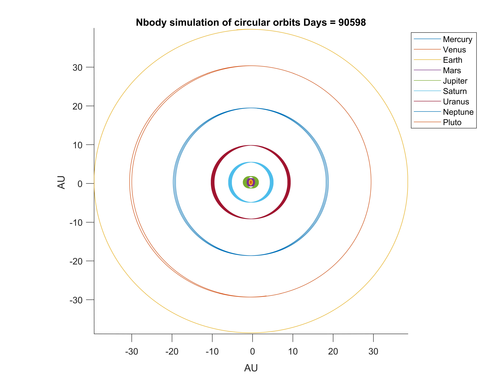

# N-body-problem

Solution of the N-Body Problem with 12-order Runge-Kutta in C using parallel processors with ALL-Pairs algorithm.

The computation has two steps:
1. Compute the forces on each element
2. Move each element a bit based on this force, and then repeat

Since each object computes the forces on it from each other object ($N$ objects). Thus, the work complexity of this problem is a $N^2$ algorithm. Each object must compute its interaction with each other object so each of N objects has to compute $N−1$ forces.

